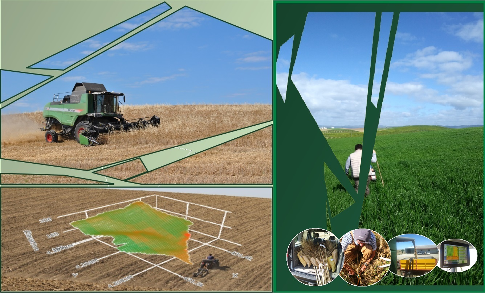
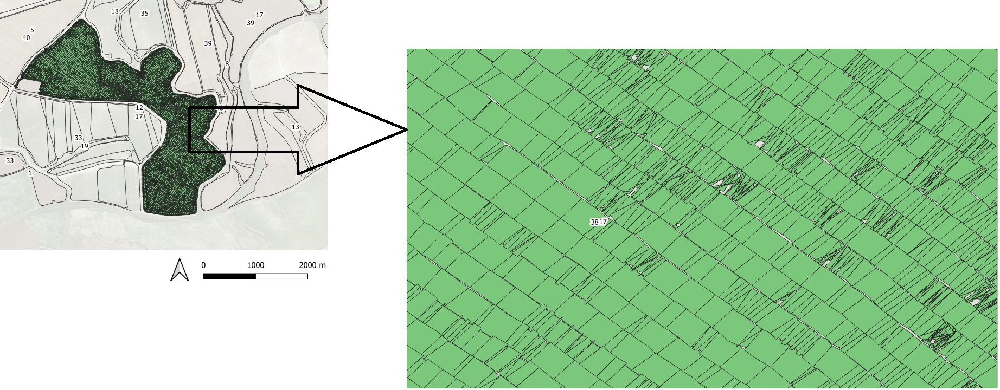
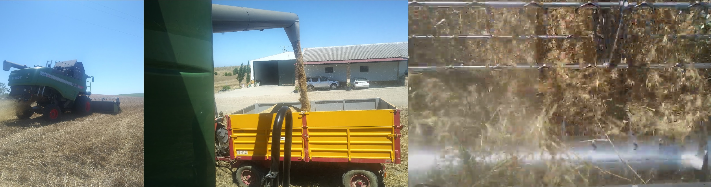
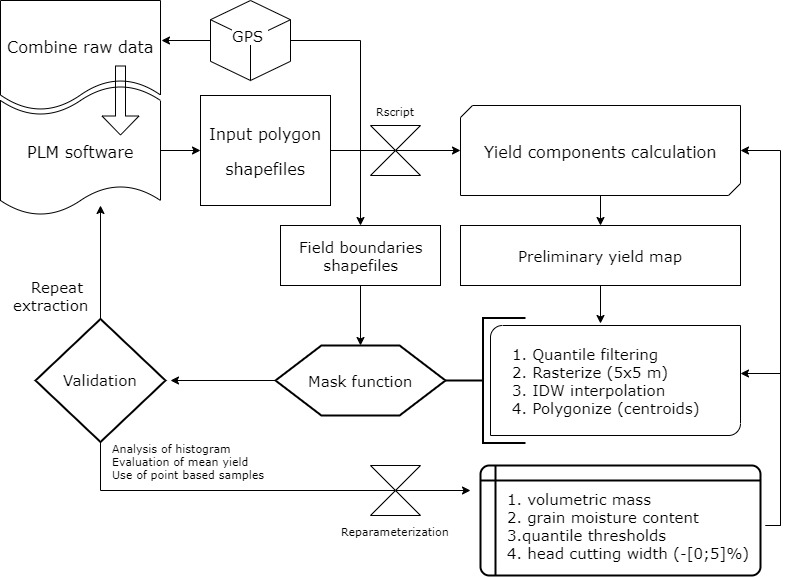
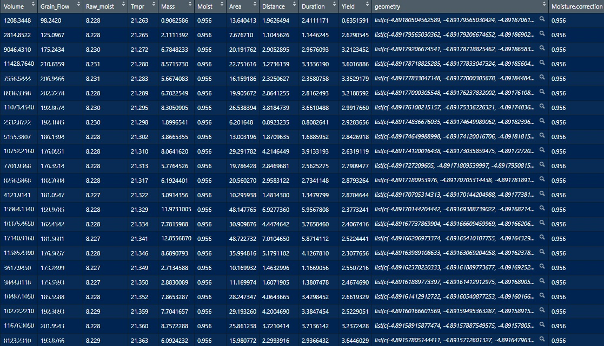
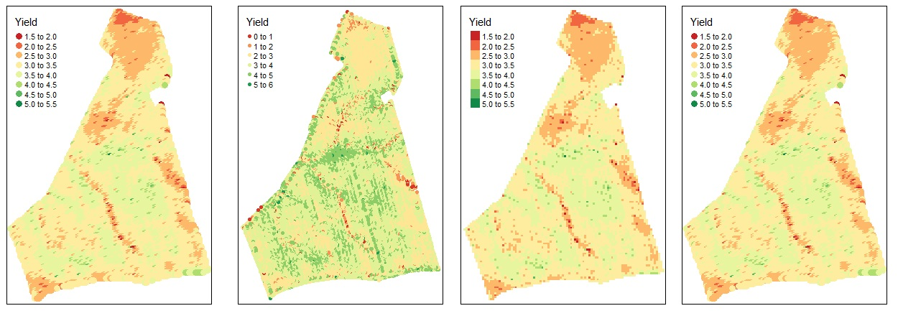
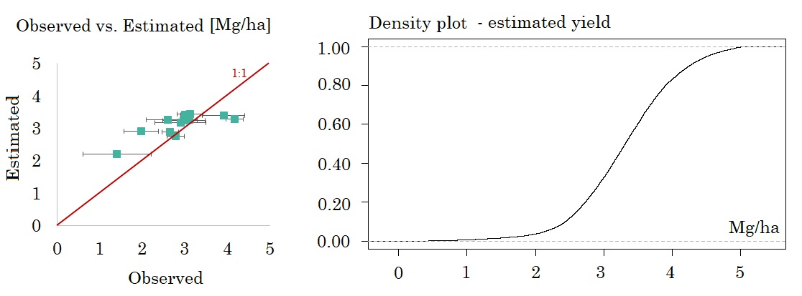
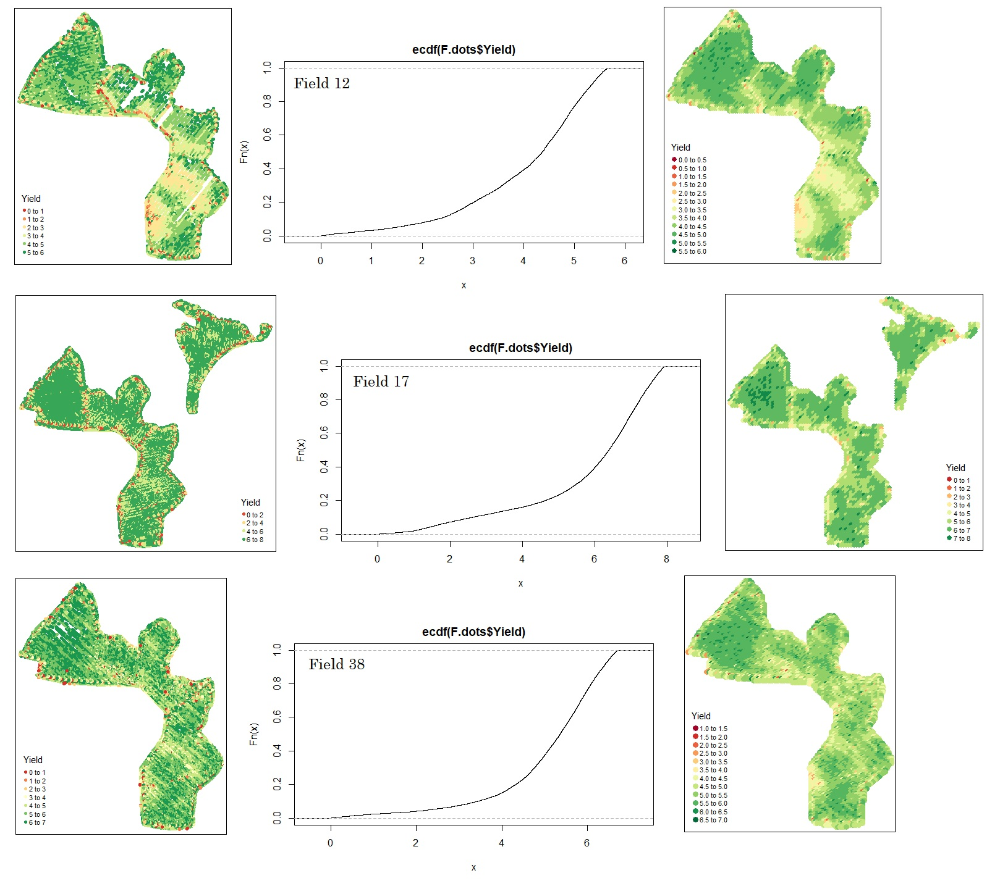

# Yield Mapping 
R script and calculation procedure for spatial mapping of grain yield



> Author: Tomás Roquette Tenreiro

> Institute for Sustainable Agriculture (IAS-CSIC) - Córdoba, 2020

This repository addresses the topic of yield mapping. It provides a detailed introduction to yield mapping components, technology, the main calculation process errors, and recomendations for correction, further analysis and interpretation of results. 

## 1. Yield mapping components and technology 

### 1.1. What do yield maps represent?

Yield maps provide valuable spatial information on how crops perform in response to a certain degree of Environmental (E) conditions and/or Management (M) practices. 

Within the same field, and for a particular growing season, the spatial variation of E (e.g. soil texture, soil water holding capacity and depth, pH and soil nutrient availability) and M (e.g. sowing rate and date, fertilization and crop protection) determine what can be understood as a 'short-term' phenotypic response (P) to variable conditions in combination with the grown genotype (G). When analysing historical yield maps of uniformly managed fields, the GxExM interactions can be simplified as direct responses of GxE interactions. Such  interactions are not merely unidirectional, but reciprocal. The effect of E over P determine feedback mechanisms that do also affect the observed E gradient over a single field. Passioura. (2002) provided a well structured scheme of such behaviour (i.e. Figure 4). The spatial variation of crop performance (P=GxE), which in this case is quantified in terms of grain yield, is in fact the result of multi-directional relations along the vector of interactions that links P to G and E for a single field and year. 

Site-specific management depends on such theoretical considerations, as the first step towards precision management is the quantification of crop variations over space and time. Yield maps provide us one of the most pragmatic and technically oriented sort of data to pursuit such strategy. 

- Passioura, J. B. (2002). Environmental biology and crop improvement. Functional Plant Biology, 29(5), 537-546.

### 1.2. What are the main components of yield mapping?

Several approaches have been developed for continuous yield sensing. The commercial yield monitors that are currently used by farmers are based on a wide range of methods and technologies. The most common include a paddle wheel volume flow sensor, a momentum plate sensor, a gamma ray sensor, strain gage based impact sensors, and an infrared sensor. A compelling review of such technologies is provided by Arslan & Colvin. (2002). 

- Arslan, S., & Colvin, T. S. (2002). Grain yield mapping: Yield sensing, yield reconstruction, and errors. Precision Agriculture, 3(2), 135-154.

Grain flow can be measured both in terms of mass or volume flow. For the specific case of raw values collected by the harvester Fendt PLI C 5275, which we use, and for data extracted with the 'New Holland' Precision Land Manager (PLM) software, both variables can be accessed. In this particular example, we use volume data as the grain flow variable. Volume flow (V) is expressed in cubic centimeters per second. To convert volume into absolute grain mass (Mg), we use a factor based on grain density (mv) or volumetric weigth (expressed in kg per Liter). This is a possible source of error, that can propage into final yield estimates, which must be taken into account. 

```{r}
Mg [kg/s] = V [cm3/s] * mv [kg/L] / 1000 
```

Volume flow is measured by a paddle wheel flow sensor which consists of multiple wheels. These rotate while grain accumulates as measured by a level sensor. The volume flow is quantified as the number of rotations per unit of time multiplied by the volume of the paddle wheel. 


Once estimated grain mass, a moisture correction factor (MF) is applied to the calculation process. This step gains particular importance in those crops that are harvested with higher levels of moisture content, or in more humid regions. 

```{r}
MF = (100 - Moisture [%])/100
```
The harvested mass takes some time to move from the head of the combine to the yield sensor. This period is called the “time delay” or the “lag time", which is non-linear. During the time delay, multiple processes of conveying, threshing, separation, and cleaning take place. Several authors have dedicated attention to this particular issue, examples are Searcy et al. (1989), Lark et al. (1997), Birrell et al. (1996). For simplification purposes, we assume a flow model that uses a constant value of grain transportation time delay. The grain entering the combine is considered to move at a constant rate, without disturbance, until the sensor plate. The grain flow volume is therefore matched to position data in order to determine actual coordinates of yield. 

- Birrell, S. J., Sudduth, K. A., & Borgelt, S. C. (1996). Comparison of sensors and techniques for crop yield mapping. Computers and Electronics in agriculture, 14(2-3), 215-233.

- Lark, R. M., Stafford, J. V., & Bolam, H. C. (1997). Limitations on the spatial resolution of yield mapping for combinable crops. Journal of Agricultural Engineering Research, 66(3), 183-193.

- Searcy, S. W., Schueller, J. K., Bae, Y. H., Borgelt, S. C., & Stout, B. A. (1989). Mapping of spatially variable yield during grain combining. Transactions of the ASAE, 32(3), 826-0829.

The shapefiles extracted with the PLM software consist of multiple polygon shapes, which are georeferred and spatially separated. The actual coordinates of yield are considered as the centroid of the respective shape polygon being considered. Two different factors determine this aspect:

1) The machine head cutting width (expressed in meters).

2) The machine driving speed (expressed in meters per second). 



Each polygon has a different area but constant width (corresponding to the machine head cuttting width, expressed in meters). This means that raw data (i.e. the shape centroid) is mapped with constant width spatial resolution but variable length resolution. Each shape is mathematically represented by a vector of numeric attributes (e.g. mean driving speed, grain moisture content, grain volume flow). For each shape, the  lenght distance (d) and the duration of length driving speed (t) are respectivelly estimated as:

```{r}
d [m] = area [m2] / width [m]

t [s] = d [m] / speed [m/s] 
```

Reitz and Kutzbach. (1996) proposed an equation to calculate yield from the previous components (i.e. grain volume flow, the moisture factor, the polygon shape area and the driving length duration). The equation can be synthesized as following:

```{r}
Y [kg/m2] = ( Mg [kg/s] * MF * t [s] ) / area [m2]

Y [Mg/ha] = 10 * Y [kg/m2]
```

 - Reitz, P., & Kutzbach, H. D. (1996). Investigations on a particular yield mapping system for combine harvesters. Computers and electronics in agriculture, 14(2-3), 137-150.
 
If the PLM extraction delivers grain volume in terms of mass, expressed solely in kg, the duration term can be removed from the equation of Reitz and Kutzbach. (1996), being simplified as following: 

```{r}
V corresponds to the sum of volume measured within the same shape at a constant time-step

Mg [kg] = V [cm3] * mv [kg/L] / 1000 

Y [Mg/ha] = 10 * ( Mg [kg] * MF ) / area [m2]
```

## 2. Identification and correction of process errors

### 2.1. The error sources

An absolutely accurate yield map may be a false promise as multiple sources of error exist within this process and their complete elimination is unlikely to be achieved. From a data analysis perspective, the objective won't be a full absence of error but its understanding and minimization as far as possible. In practice, the aim is trying to opperate under known levels of error and stable over space. Many possible sources of error must be considered:

1) grain volumetric mass;
2) grain moisture content;
3) sensing errors;
4) operator errors;
5) partial lack of data points and other types of mapping errors;
6) unstable and large time-delay;
7) unkown crop cutting width;
8) inherent errors from GPS;

- Thylen, L., Jurschik, P. and Murphy, D. P. L. 1997. Improving the quality of yield data. In: First European Conference on  Precision  Agriculture, Vol.II:  Technology, IT and Management, edited by J. V. Stafford(UK), p. 743–750.



Small variations of grain volumetric mass or moisture content, mostly common among different fields, may requiere further adjustments. This can be done by assessing the mean yield, or the total yield for a known area, as input material for validation. Operator errors consist for instance of unadequate driving speed, leading to underintake of grain in situations of overspeed, or a wrong cutting height level. Blackmore & Marshall. (2003) indicated that the cutting width factor may be reduced on about 5% due to partial emptiness of the header during the cutting operation.

- Blackmore, B., & Marshall, C. (2003, February). Yield mapping; errors and algorithms. In Proc. 3rd Int. Conf. Precis. Agric., ed. by PC Robert, RM Rust, WE Larsen (ASA CSSA SSSA, Madison 1996) p (Vol. 403).

The calibration of variable input parameters can be done through evaluation of yield map accuracy at point level as well. However this requires manual sampled yield data. Please do not ignore that the calibration of the flow sensor is probably one of the most important sources of error in yield monitors. 

 
### 2.2. Error correction

A simple correction algorithm, inspired by Simbahan et al. (2004) and Ping & Dobermann. (2005), was developed. The algorithm selects all points above and below certain quantile thresholds, applied to both defect and excess cases. These thresholds require adjustments that depend on the validation data used (e.g. point-based manual samples, mean yield records or total yield over a known area registered). The algorithm rejects all dots selected, turning them into NULL data points. A raterize function (i.e. vector to raster) is applied to the centroids of the input polygon shapes. A 5x5 m spatial resolution raster is produced and an 'Inverse Distance Weight' (IDW) interpolation technique is run to cover empty spots with interpolated data. The 'mask function' is then used to filter all pixels inside the boundaries of the corresponding field of interest and the spatial information is poligonized back to point based data in order to map the final outcome as a shapefile.  

- Simbahan, G. C., Dobermann, A. and Ping, J. L. 2004. Screening yield monitor data improves grain yieldmaps. Agronomy Journal96, 1091–1102.

- Ping, J. L., & Dobermann, A. (2005). Processing of yield map data. Precision Agriculture, 6(2), 193-212.



## 3. The R-script for mapping grain yield

### 3.1. The script

The first step consists on installing all necessary libraries for this analysis and setting up the working directory. In this section we set initial details to specify the working directory; in this particular case the analysis was linked to the internal folder "La Reina - Datos" where input and output data is saved. To run this code please specify the working directory where your input files are saved.

```{r}
# install libraries
install.packages("rmarkdown")
install.packages("dplyr")
install.packages("plyr")
install.packages("reshape2")
install.packages("agricolae")
install.packages("quantreg")
install.packages("ploty")
install.packages("sf")
install.packages("raster")
install.packages("spData")
install.packages('spDataLarge', repos='https://nowosad.github.io/drat/', type='source')
install.packages("gridExtra")
install.packages("RColorBrewer")
install.packages("root.dir")
install.packages("tidyverse")
install.packages("ggplot2")
install.packages("wesanderson")
install.packages("ggpmisc")
install.packages("knitr")
install.packages("installr")
install.packages("lmtest", repos = "http://cran.us.r-project.org")
install.packages("tinytex")
install.packages("sm")
install.packages("randomcoloR")
install.packages("Lahman")

# Upload libraries
library(knitr)
library(sf)
library(dplyr)  
library(plyr)
library(reshape2)
library(agricolae)
library(quantreg)
library(plotly)
library(sp)
library(spDataLarge)
library(spData)
library(tmap)
library(raster)
library(gridExtra)
library(quantreg)
library(ggplot2)
library(RColorBrewer)
library(gridExtra)
library(wesanderson)
library(ggpmisc)
library(markdown)
library(tinytex)
library(lmtest)
library(gstat)
library("ggpubr")
```

Main shapes are uploaded, these include a specific polygon shapefile with the considered plot harvested data (in this case we will work with "field 36" data) and the general shapefiles with the georeferenced boundaries of all plots to be included in our analysis. 

```{r}
rm(list=ls())
getwd()
setwd ("C:/Users/Tomas R. Tenreiro/Desktop/La Reina - Datos")
SAT.Imagery  <- raster("2020-10-15-00_00_2020-10-15-23_59_Sentinel-2_L2A_True_color.tiff")
setwd ("C:/Users/Tomas R. Tenreiro/Desktop/La Reina - Datos/Trigo/Vector.Files")
Plots <- st_read("Parcelas.shp")
setwd ("C:/Users/Tomas R. Tenreiro/Desktop/La Reina - Datos/Trigo/ShapeFiles/2020")
Field <- st_read("Yield.36.shp")
```

The yield components are calculated and yield is estimated according to a simplification of the Reitz and Kutzbach. (1996)' equation. The Wheat Volumetric Mass (WVM) corresponds to the grain density (mv) previously introduced. The Cutting Width Factor (CWF) is set, in this case we use the head width of the harvester Fendt PLI C 5275. 

```{r}
# Wheat Volumetric Mass (kg/L)
WVM = 0.75

# Cutting Width Factor (m)
CWF = 6.95

# Yield Estimator
Field$Mass                  <- Field$Volume * (WVM / 1000)
Field$Moisture.correction   <- (100 - Field$Moisture) / 100
Field$Area                  <- as.vector(st_area(Field)) 
Field$Distance              <- Field$Area / CWF
Field$Duration              <- Field$Distance / Field$Speed 

# Yield Estimation (Mg/ha)
Field$Yield  <- (Field$Mass * Field$Moisture.correction * 10) / Field$Area
```




```{r}
# Identify outliers
x <- quantile(Field$Yield, c(.95))
Field$Yield[Field$Yield>x]  <- 0
x <- quantile(Field$Yield, c(.01))
Field$Yield[Field$Yield<x]  <- 0

# Get centroids of poligons
F.dots = st_centroid(Field)

# Remove data outliers (NA)
F.dots$Yield[F.dots$Yield == 0] <- NA
F.dots <- F.dots[!is.na(F.dots$Yield), ]

# Yield mapping (centroids without NA's)
tm_shape(F.dots) + tm_dots(col="Yield", palette = "RdYlGn", n=5, size=0.1)

# Density plot
P = ecdf(F.dots$Yield)    
P(0.0)        
plot(P)

# Correct gaps by IDW interpolation
r = raster(F.dots, ncol = 100, nrow = 150)
gs = gstat(formula = Yield~1, locations = F.dots)
idw = interpolate(r, gs)

# Mask & print yield map
YM = mask(idw, Plots)
names(YM)[names(YM) == "var1.pred"] <- "Yield"
tm_shape(YM) + tm_raster(col="Yield", palette = "RdYlGn", n=5)
YM <- rasterToPoints(YM, spatial = TRUE) %>% st_as_sf()
tm_shape(YM) + tm_dots(col = "Yield", palette = "RdYlGn", n=10, size = 0.4)

#setwd ("C:/Users/Tomas R. Tenreiro/Desktop/La Reina - Datos/Yield.Maps")
#st_write(YM, "YM.36.shp", driver="ESRI Shapefile")  # create to a shapefile 

crs(YM)

```



### 3.2. The validation set

The density plot generated is evaluated. We use both mean registered yield and 12 manual samples of yield to validate the parameterization that was followed. The mean measured yield (i.e. observed) of this field was 2.9 (±0.3) Mg/ha, the estimated mean is 3.1 Mg/ha. This seems to be caused by an over estimation (i.e. about 35%) of yield in the least productive zones. 

|Point | Observed (Mg/ha)    | Std. dev              | Estimated (Mg/ha)   | Point | Observed (Mg/ha)    | Std. dev      | Estimated (Mg/ha)   | 
|------|--------------|---------------|--------------|---------------------|-----------------------------|---------------|---------------------|
| 1    |     1.98     |    0.4        |      2.92    |  7    |     2.66     |    0.2        |      2.90    |
| 2    |     2.98     |    0.5        |      3.25    |  8    |     3.00     |    0.1        |      3.43    | 
| 3    |     2.60     |    0.5        |      3.26    |  9    |     3.10     |    0.2        |      3.27    | 
| 4    |     3.91     |    0.5        |      3.41    |  10   |     2.79     |    0.2        |      2.76    |
| 5    |     2.90     |    0.6        |      3.41    |  11   |     3.12     |    0.3        |      3.45    |
| 6    |     4.17     |    0.2        |      4.13    |  12   |     1.41     |    0.8        |      2.22    |



### 3.3. An additional example

Let's apply the R-code to a different crop field for three different years of data. We select the field 'caracol' to map grain yield for 2016, 2018 and 2020. The harvest extracted data are saved in shapefiles named as "Field.12", Field.17", "Field.38", respectively.

```{r}

# Plot 12
setwd ("C:/Users/Tomas R. Tenreiro/Desktop/La Reina - Datos/Trigo/Vector.Files")
Plots <- st_read("Parcelas.shp")
setwd ("C:/Users/Tomas R. Tenreiro/Desktop/La Reina - Datos/Trigo/ShapeFiles/2016")
Field <- st_read("Yield.12.shp")

# Plot id
idp <- 12

# Wheat Volumetric Mass (kg/L)
WVM = 0.75

# Cutting Width Factor (m)
CWF = 6.95

# Yield Estimator
Field$Mass                  <- Field$Volume * (WVM / 1000)
Field$Moisture.correction   <- (100 - Field$Moisture) / 100
Field$Area                  <- as.vector(st_area(Field)) 
Field$Distance              <- Field$Area / CWF
Field$Duration              <- Field$Distance / Field$Speed 

# Yield Estimation (Mg/ha)
Field$Yield  <- (Field$Mass * Field$Moisture.correction * 10) / Field$Area

# Identify outliers
x <- quantile(Field$Yield, c(.75))
Field$Yield[Field$Yield>x]  <- 0
x <- quantile(Field$Yield, c(.01))
Field$Yield[Field$Yield<x]  <- 0

# Get centroids of poligons
F.dots = st_centroid(Field)

# Remove data outliers (NA)
F.dots$Yield[F.dots$Yield == 0] <- NA
F.dots <- F.dots[!is.na(F.dots$Yield), ]

# Yield mapping (centroids without NA's)
tm_shape(F.dots) + tm_dots(col="Yield", palette = "RdYlGn", n=5, size=0.1)

# Density plot
P = ecdf(F.dots$Yield)    
P(0.0)        
plot(P)

# Correct gaps by IDW interpolation
r = raster(F.dots, ncol = 100, nrow = 100)
gs = gstat(formula = Yield~1, locations = F.dots)
idw = interpolate(r, gs)

# Mask & print yield map
Plots <- subset(Plots, id==idp)
YM = mask(idw, Plots)
names(YM)[names(YM) == "var1.pred"] <- "Yield"
YM <- rasterToPoints(YM, spatial = TRUE) %>% st_as_sf()
tm_shape(YM) + tm_dots(col = "Yield", palette = "RdYlGn", n=8, size = 0.3)

# Plot 17
setwd ("C:/Users/Tomas R. Tenreiro/Desktop/La Reina - Datos/Trigo/Vector.Files")
Plots <- st_read("Parcelas.shp")
setwd ("C:/Users/Tomas R. Tenreiro/Desktop/La Reina - Datos/Trigo/ShapeFiles/2018")
Field <- st_read("Yield.17.shp")

# Plot id
idp <- 17

# Wheat Volumetric Mass (kg/L)
WVM = 0.75

# Cutting Width Factor (m)
CWF = 6.95

# Yield Estimator
Field$Mass                  <- Field$Volume * (WVM / 1000)
Field$Moisture.correction   <- (100 - Field$Raw_moist) / 100
Field$Area                  <- as.vector(st_area(Field)) 
Field$Distance              <- Field$Area / CWF
Field$Duration              <- Field$Distance / Field$Speed 

# Yield Estimation (Mg/ha)
Field$Yield  <- (Field$Mass * Field$Moisture.correction * 10) / Field$Area

# Identify outliers
x <- quantile(Field$Yield, c(.7))
Field$Yield[Field$Yield>x]  <- 0
x <- quantile(Field$Yield, c(.01))
Field$Yield[Field$Yield<x]  <- 0

# Get centroids of poligons
F.dots = st_centroid(Field)

# Remove data outliers (NA)
F.dots$Yield[F.dots$Yield == 0] <- NA
F.dots <- F.dots[!is.na(F.dots$Yield), ]

# Yield mapping (centroids without NA's)
tm_shape(F.dots) + tm_dots(col="Yield", palette = "RdYlGn", n=5, size=0.1)

# Density plot
P = ecdf(F.dots$Yield)    
P(0.0)        
plot(P)

# Correct gaps by IDW interpolation
r = raster(F.dots, ncol = 100, nrow = 100)
gs = gstat(formula = Yield~1, locations = F.dots)
idw = interpolate(r, gs)

# Mask & print yield map
Plots <- subset(Plots, id==idp)
YM = mask(idw, Plots)
names(YM)[names(YM) == "var1.pred"] <- "Yield"
YM <- rasterToPoints(YM, spatial = TRUE) %>% st_as_sf()
tm_shape(YM) + tm_dots(col = "Yield", palette = "RdYlGn", n=8, size = 0.3)

# Plot 38
setwd ("C:/Users/Tomas R. Tenreiro/Desktop/La Reina - Datos/Trigo/Vector.Files")
Plots <- st_read("Parcelas.shp")
setwd ("C:/Users/Tomas R. Tenreiro/Desktop/La Reina - Datos/Trigo/ShapeFiles/2020")
Field <- st_read("Yield.38.shp")

# Plot id
idp <- 38

# Wheat Volumetric Mass (kg/L)
WVM = 0.75

# Cutting Width Factor (m)
CWF = 6.95

# Yield Estimator
Field$Mass                  <- Field$Volume * (WVM / 1000)
Field$Moisture.correction   <- (100 - Field$Moisture) / 100
Field$Area                  <- as.vector(st_area(Field)) 
Field$Distance              <- Field$Area / CWF
Field$Duration              <- Field$Distance / Field$Speed 

# Yield Estimation (Mg/ha)
Field$Yield  <- (Field$Mass * Field$Moisture.correction * 10) / Field$Area

# Identify outliers
x <- quantile(Field$Yield, c(.75))
Field$Yield[Field$Yield>x]  <- 0
x <- quantile(Field$Yield, c(.01))
Field$Yield[Field$Yield<x]  <- 0

# Get centroids of poligons
F.dots = st_centroid(Field)

# Remove data outliers (NA)
F.dots$Yield[F.dots$Yield == 0] <- NA
F.dots <- F.dots[!is.na(F.dots$Yield), ]

# Yield mapping (centroids without NA's)
tm_shape(F.dots) + tm_dots(col="Yield", palette = "RdYlGn", n=5, size=0.1)

# Density plot
P = ecdf(F.dots$Yield)    
P(0.0)        
plot(P)

# Correct gaps by IDW interpolation
r = raster(F.dots, ncol = 100, nrow = 150)
gs = gstat(formula = Yield~1, locations = F.dots)
idw = interpolate(r, gs)

# Mask & print yield map
Plots <- subset(Plots, id==idp)
YM = mask(idw, Plots)
names(YM)[names(YM) == "var1.pred"] <- "Yield"
YM <- rasterToPoints(YM, spatial = TRUE) %>% st_as_sf()
tm_shape(YM) + tm_dots(col = "Yield", palette = "RdYlGn", n=8, size = 0.4)
```



## 4. Additional reading material

- https://www.datanovia.com/en/blog/top-r-color-palettes-to-know-for-great-data-visualization/

- https://github.com/RoquetteTenreiro/SDAE_R_lecture

- https://geocompr.robinlovelace.net/

- https://www.rspatial.org/index.html
