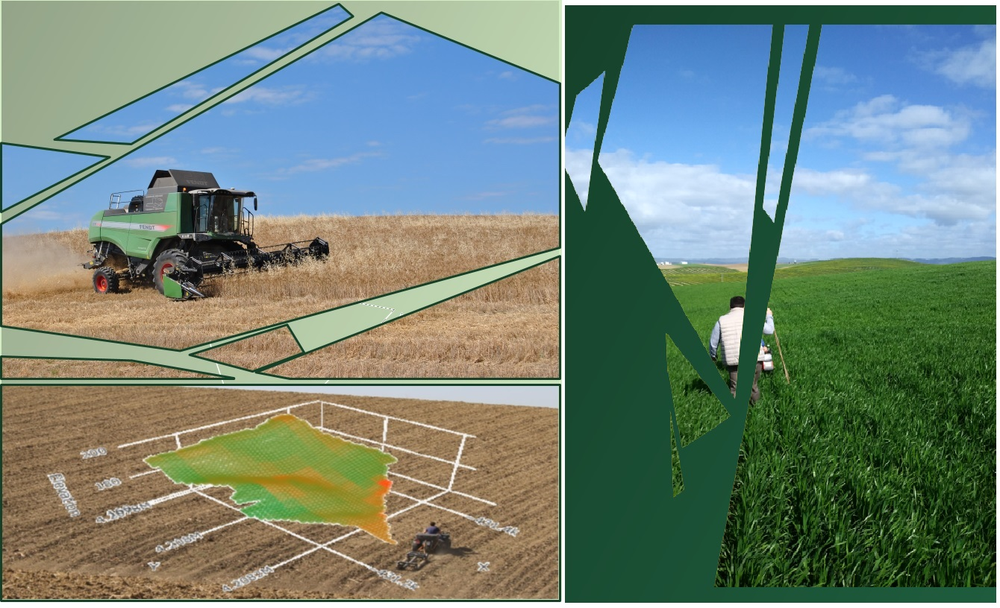
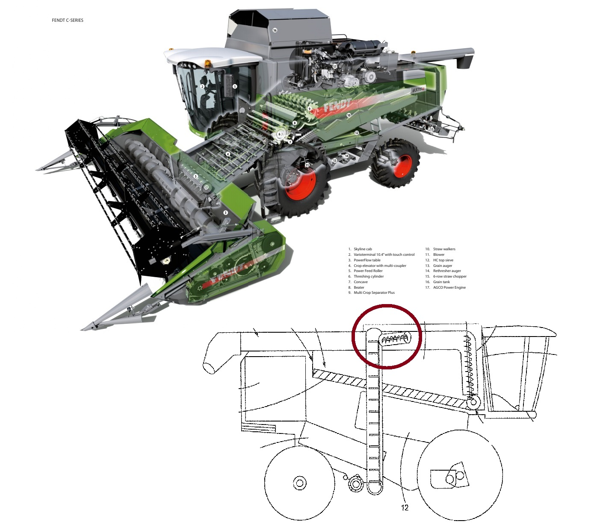

# Yield Mapping 
R script and calculation procedure for spatial mapping of grain yield



> Author: Tomás Roquette Tenreiro

> Institute for Sustainable Agriculture (IAS-CSIC) - Córdoba, 2020

This repository addresses the topic of yield mapping. It provides a detailed evaluation of yield mapping components, technology, the main calculation process errors, and recomendations for correction, further analysis and interpretation of results. 

## 1. Yield mapping components and technology 

### 1.1. What do yield maps represent?

Yield maps provide valuable spatial information on how crops perform in response to a certain degree of Environmental (E) conditions and/or Management (M) practices. 

Within the same field, and for a particular growing season, the spatial variation of E (e.g. soil texture, soil water holding capacity and depth, pH and soil nutrient availability) and M (e.g. sowing rate and date, fertilization and crop protection) determine what can be understood as a 'short-term' phenotypic response (P) to variable conditions in combination with the grown genotype (G). When analysing historical yield maps of uniformly managed fields, the GxExM interactions can be simplified as direct responses of GxE interactions. Such  interactions are not merely unidirectional, but reciprocal. The effect of E over P determine feedback mechanisms that do also affect the observed E gradient over a single field. Passioura. (2002) provided a well structured scheme of such behaviour (i.e. Figure 4). The spatial variation of crop performance (P=GxE), which in this case is quantified in terms of grain yield, is in fact the result of multi-directional relations along the vector of interactions that links P to G and E for a single field and year. 

Site-specific management depends on such theoretical considerations, as the first step towards precision management is the quantification of crop variations over space and time. Yield maps provide us one of the most pragmatic and technically oriented sort of data to pursuit such strategy. 

- Passioura, J. B. (2002). Environmental biology and crop improvement. Functional Plant Biology, 29(5), 537-546.

### 1.2. What are the main components of yield mapping?

Several approaches have been developed for continuous yield sensing. The commercial yield monitors that are currently used by farmers are based on a wide range of methods and technologies. The most common include a paddle wheel volume flow sensor, a momentum plate sensor, a gamma ray sensor, strain gage based impact sensors, and an infrared sensor. A compelling review of such technologies is provided by Arslan & Colvin. (2002). 

- Arslan, S., & Colvin, T. S. (2002). Grain yield mapping: Yield sensing, yield reconstruction, and errors. Precision Agriculture, 3(2), 135-154.

Grain flow can be measured both in terms of mass or volume flow. For the specific case of raw values collected by the harvester Fendt PLI C 5275, which we use, and for data extracted with the 'New Holland' Precision Land Manager (PLM) software, both variables can be accessed. In this particular example, we use volume data as the grain flow variable. Volume flow (V) is expressed in cubic centimeters per second. To convert volume into absolute grain mass (Mg), we use a factor based on grain density (mv) or volumetric weigth (expressed in kg per Liter). This is a possible source of error, that can propage into final yield estimates, which must be taken into account. 

```{r}
Mg [kg/s] = V [cm3/s] * mv [kg/L] / 1000 
```

Volume flow is measured by a paddle wheel flow sensor which consists of multiple wheels. These rotate while grain accumulates as measured by a level sensor. The volume flow is quantified as the number of rotations per unit of time multiplied by the volume of the paddle wheel. 



Once estimated grain mass, a moisture correction factor (MF) is applied to the calculation process. This step gains particular importance in those crops that are harvested with higher levels of moisture content, or in more humid regions. 

```{r}
MF = (100 - Moisture [%])/100
```
The harvested mass takes some time to move from the head of the combine to the yield sensor. This period is called the “time delay” or the “lag time", which is non-linear. During the time delay, multiple processes of conveying, threshing, separation, and cleaning take place. Two different factors determine this aspect:

1) The machine head cutting width (expressed in meters).

2) The machine driving speed (expressed in meters per second). 

The shapefiles extracted with the PLM software consist of multiple polygon shapes, which are georeferred and spatially separated. Each polygon has a different area but constant width (corresponding to the machine head cuttting width, expressed in meters). Each shape is mathematically represented by a vector of numeric attributes (e.g. mean driving speed, grain moisture content, grain volume flow). For each shape, the  lenght distance (d) and the duration of length driving speed (t) are respectivelly estimated as:

```{r}
d [m] = area [m2] / width [m]

t [s] = speed [m/s] / d [m]
```

